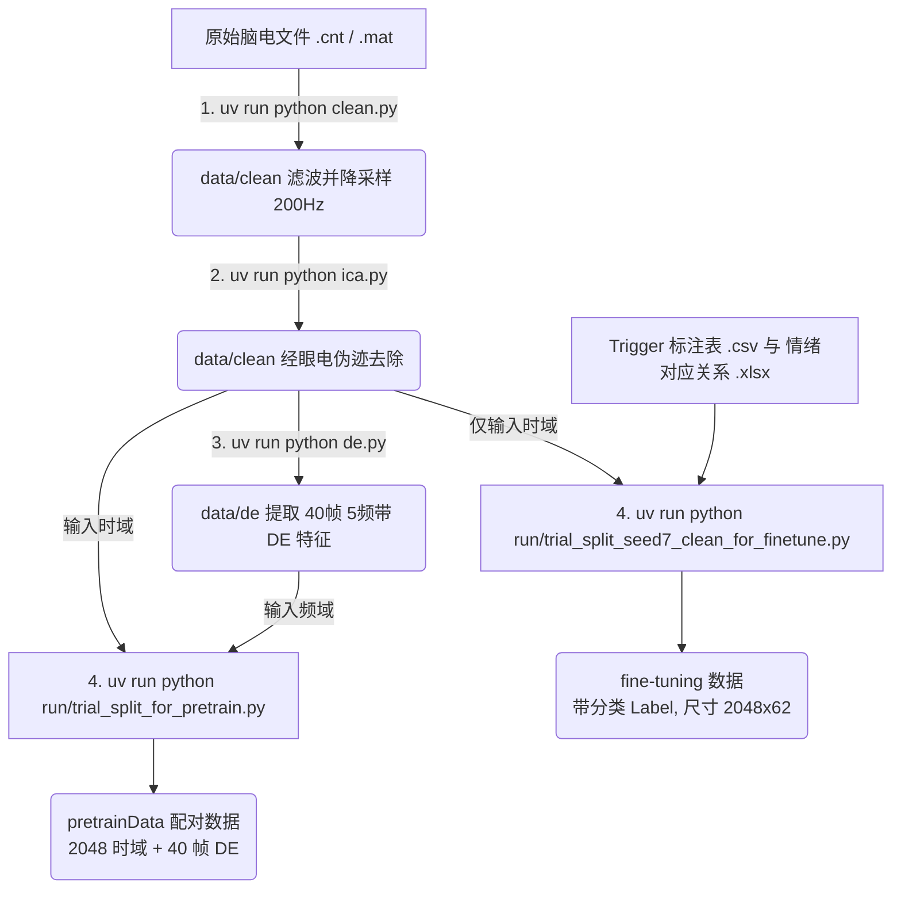

# EEG 情绪识别预处理项目指南 (EEG Preprocessing Pipeline)

本指南将\完成数据清洗、去伪迹、特征提取，直到最终切分为可供模型直接读取的 `.npz` 格式数据。

---

## 1. 项目概述

在情绪识别领域，脑电（EEG）信号十分嘈杂且维度繁多，直接将原始信号丢给深度学习模型往往效果不佳。因此，**预处理（Preprocessing）** 是至关重要的一环。

本项目针对连续的脑电序列数据，提供了一套高度自动化的流水线，主要完成以下目标：
1. **时域清理**：降采样、带通滤波、去除由于眨眼/肌肉活动产生的异常伪迹（通过 ICA）。
2. **频域特征提取**：提取深度学习中极为常用的脑电特征——**微分熵（Differential Entropy, DE）**。
3. **样本切分与对齐**：按照实验触发标记（Trigger），将超长的连续信号切割为定长的样本序列（例如 2048 个采样点的大段 Clean 数据，及对应的 40 帧 DE 特征）。
4. **统一格式输出**：最终输出尺寸统一、排列整齐的预训练（Pretrain）对齐样本，以及微调（Finetuning）用的带情绪标签样本。

---

## 2. 数据集

本项目统一兼容多代 SEED（SJTU Emotion EEG Dataset）情绪脑电数据集：
- **SEED (SEED-I)**
- **SEED-IV**
- **SEED-V**
- **SEED-VII**

在处理流程中，我们会将所有数据集强行对齐为统一规范的 **62个标准电极通道** 格式。

---

## 3. 项目结构与主要文件功能

仓库文件布局如下：

```text
preprocessing/
├── README.md                                  
├── pyproject.toml                               # uv 包管理与 Python 环境配置文件
├── config.py                                    # 项目全局配置（如采样率 200Hz，滤波参数等）
├── run/                                         # 具体的“执行层”脚本集合
│   ├── trial_split_for_pretrain.py              # 【核心】生成无监督/预训练数据对：时域(2048,62) 配对 频域(40,62,5)
│   ├── trial_split_seed7_clean_for_finetune.py  # 【核心】为 SEED-VII 按情绪标签切分出 2048长度的微调数据
|   ├── read.py                                  # 针对各类原始 CNT/MAT 文件的低层读取函数
|   ├── clean.py                                 # 对原始数据执行带通/陷波滤波操作，并将通道标准化
|   ├── ica.py                                   # 通过独立成分分析(ICA)自动去除眼电等特定伪迹
|   ├── de.py                                    # 微分熵(DE)特征提取核心脚本，支持五大频带的特征计算
|   ├── make_labels_seed7.py                     # 专门为 SEED-VII 生成或核对 Trigger 及标签的工具脚本
|   ├── trial_split.py                           # 【通用】针对 DE 特征的 trial 级别切分，包含对齐及插值修复
|   └── ... 
└── data/                                        # 所有数据的存放根目录
    ├── clean/                                   # 存放经过 clean.py 与 ica.py 处理后的干净 MAT 数据
    ├── de/                                      # 存放经过 de.py 处理后的微分熵特征 MAT 文件
    ├── ica/                                     # 存放经过 ica.py 处理过的去伪迹 MAT 文件
    └── emotion-detect/                          # 存放最终切割好的 NPZ 模型输入数据
```

---

## 4. 数据存储结构

数据按照“原始 -> 中间态 -> 模型输入”的严格层级存放：

- `data/bdf/` 或 `data/cnt/` (等)：**原始格式**存放地。
- `data/clean/`：存放滤波去噪后的 `SEED-*.mat` 文件（变量包含 `data`，尺寸统一为 `(62, n_samples)`）。
- `data/de/`：存放提取出的 DE 频域特征文件（变量包含 `de`，尺寸一般为 `(时间帧数, 62通道, 5个频带)`）。
- `data/emotion-detect/pretrainData/`：存放预训练所需的成对样本 `.npz`，每个样本包含长度 2048 的时域信号，及对应的 40 帧 DE。
- `data/emotion-detect/fine-turning/set1-ED/`：存放 SEED-VII 等数据集切割好的、携带真实情绪标签的 `.npz` 文件，尺寸固定 `(2048, 62)` 长度在前。

> **🌟 温馨提示**：生成的数据会很多很庞大，请确保你在挂载了充足存储的主机上运行！

---

## 5. 项目环境管理 (使用 uv)

本项目强烈要求使用超快的 **`uv`** 进行依赖管理，并且**严格锁定了版本**！
> **极度重要避坑点**：如果 Python 或 MNE/SciPy 版本不对，部分 C 扩展（如读取 `.cnt`）会直接产生 `Segmentation Fault (Segfault)` 导致整个程序直接系统级闪退崩溃且没有任何提示。

### 安装与启动步骤

1. **安装 uv 本身**（如果你还没有）：
   ```bash
   curl -LsSf https://astral.sh/uv/install.sh | sh
   ```
2. **安装指定版本的 Python**：
   本项目锁定使用 **Python 3.8**，必须执行：
   ```bash
   uv python install 3.8
   ```
3. **根据配置极速同步依赖库 (自动建虚拟环境)**：
   只需在项目根目录运行以下命令，即可安装 `pyproject.toml` 中指定的明确版本（如 `mne==0.23.0`, `scipy`，以及特定版本的读取扩展）：
   ```bash
   uv sync
   ```
4. **运行脚本的方法**：
   不要直接用 `python xxx.py`，必须加上 `uv run` 来确保调用的是虚拟环境里的库：
   ```bash
   uv run python run/clean.py
   ```

---

## 6. 特别注意：读取数据务必指定 int32 类型！

在处理脑电相关辅助数据（如读取标注 `label`、读取 `trigger` 时间戳、索引运算等）时，大家如果在 `numpy` 或 `scipy.io` 获取数组，**务必显示转换为 `int32`**！
- EEG 采样点经常高达几百万，在某些操作系统（如 Windows 下或某些特定版本的 NumPy）默认的整形可能会因为溢出导致索引被截断或者读取成乱码负数。
- 当我们在切分 Trial 的时候，任何一处时间戳的漂移均会导致此时的情绪和数据**错位**。保证了 `int32` 的一致性，才能确保后续时间滑窗（Window）能分毫不差地切到正确的段落。

---

## 7. 从 Raw 到 Trial Split 的整体使用顺序

初次拿到新的被试数据，请严格按照以下 **“从左往右、由浅入深”** 的顺次执行脚本：

1. **读取与清洗预处理 (Clean)**  
   把 `.cnt` 降采样为标准的 200Hz 并完成滤波，整理提取为 62 通道。输出 `data/clean`.
2. **去除伪影 (ICA) [可选但强烈推荐]**  
   清理掉数据中的眼内或肢体运动噪音。
3. **抽取特征 (DE)**  
   为每个干净的一维序列提取在 5 个频带中的特征。输出 `data/de`.
4. **验证标签与Trigger (Labeling)**  
   如果是特定数据集（如 SEED-VII），需要执行一次解析 `csv` 的脚本生成标准的记录表。
5. **切割样本 (Trial Splitting)**  
   最后，分别调用微调和预训练的脚本，把长段的连续数据切片打包成标准 `.npz` 以供神经网络读取。

---

## 8. 各大核心执行脚本 (in `run/`) 与流程图

我们将预处理的核心逻辑写成了 Mermaid 流程图，方便大家有个宏观认识：



### 1) 数据清理：`clean.py` & `ica.py` & `de.py`
- 功能：统一数据的地基。将原本可能是 1000Hz、并且含有 66通道、67通道的数据，剔除无效电极，保留有效 62 导联大脑皮层通道，同时对 5个频带进行特征抽象。
- 特性：基于 `MNE` 运作，执行耗时较长，请耐心等待。

### 2) 预训练数据生出：`run/trial_split_for_pretrain.py`
- **处理要求**：将对应的 Clean 矩阵与 DE 矩阵进行匹配裁剪。
- **切割规则**：相邻窗口的**重叠率为 0.25**。在长度为 `2048` 的 Clean 数据中，步长则为 `1536`。对应提取正中心的 `40` 帧 DE 特征组成一对。
- **输出格式**：`(2048, 62)` （注意：为了匹配常见深度学习中 `sequence_length, channels` 的习惯，此处特别做了转置使得长度在前），同时携带对应 DE `(40, 62, 5)`。

### 3) 监督微调数据生成：`run/trial_split_seed7_clean_for_finetune.py`
- **处理要求**：将 SEED-VII 的数据按情绪的呈现时间进行“外科手术式”剪切。
- **切割规则**：基于记录的起止时间秒数，换算回采样点边界，并在对应的 trial 内部做滑窗。同样重叠率为 0.25，步长为主长 2048 的 `1-0.25` 即 1536。
- **对应标签**：自动从配套的 `.xlsx` 表格映射每一次连续视觉刺激产生出的 0 到 19 的细粒度情绪类别。最终得到 `data (2048, 62)` 形式以及 `label`，供下游网络如 Transformer 等直接跑分类回归。

---

## 9. 其他补充内容和注意事项

1. **并行与批处理**：原始文件众多，目前的脚本大部分包含对文件列表的循环。如果你的 CPU 核比较多，可以通过修改主代码加入 `multiprocessing` 执行大幅缩短耗时（尤其是过滤及 DE 提取环节）。
2. **缺失与损坏的数据**：并非每一个从采集设备得到的数据都是完好的。遇到 `Segmentation Fault` 或者矩阵为空，如果确认环境配置正确，可以直接用 `try ... except ...` 过滤这少量记录并做好 log。
3. **标签的连续插值处理**：在早期对连续打分数据的处理中，由于时长和刷新率对不齐，我们在底层的 `trial_split.py` 用 `numpy.interp` 实现了基于连续波形的等比例拉伸，这是保证平滑对齐的核心逻辑不要轻易改动。
4. **输出验证**：运行出第一个被试的 npz 后，建议先自己写两行脚本用 `np.load` 打开看看 shape 和数值范围，看是否有全 0 或 `nan` 再决定跑完整个大库！

---

## 项目支持

如果在环境配置或者代码逻辑上还有什么疑惑，可以通过下方联系我：

- **孙贤达**
- **邮箱**: 15541916690@163.com

